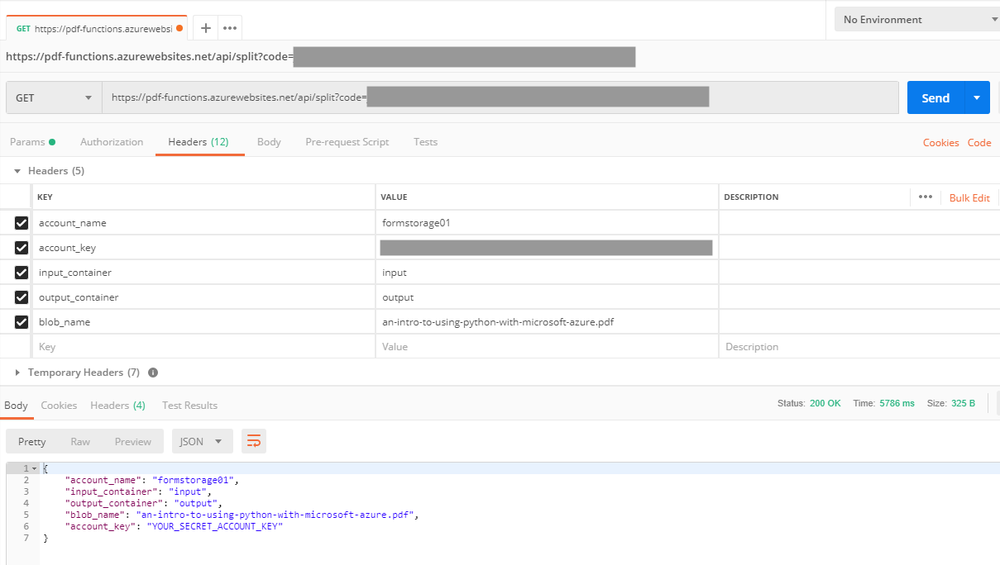
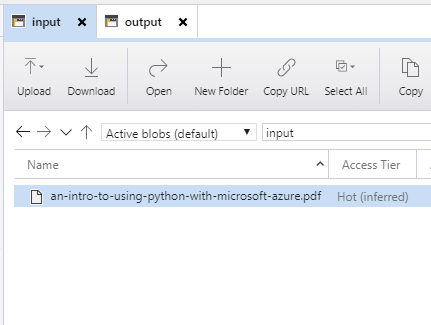
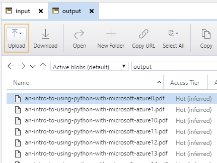

# pdf-functions
This serverless function can consume a PDF document residing on Azure Blob Storage, and split each page into an individual PDF.

## Prerequisites
1. Create a [Function App](https://docs.microsoft.com/en-us/azure/azure-functions/functions-create-first-azure-function) (OS = Linux; Runtime stack = Python)
2. Install [Visual Studio Code](https://code.visualstudio.com/)
3. Install the [Azure Functions extension](https://marketplace.visualstudio.com/items?itemName=ms-azuretools.vscode-azurefunctions) for Visual Studio Code

If you are new to deploying Python to Azure Functions, check out this [document](https://code.visualstudio.com/docs/python/tutorial-azure-functions).

## Instructions
Once the Azure Function is deployed, the function can be tested via Postman with the following HTTP headers:
* account_name (Storage account name)
* account_key (Available via the Azure Portal > Storage Account > Access Keys)
* input_container (The container within Azure Blob Storage where the input file resides)
* output_container (The container within Azure Blob Storage where the split pages will be exported to)
* blob_name (The name of the original PDF document)

## Example Postman Call

## Input

## Output

